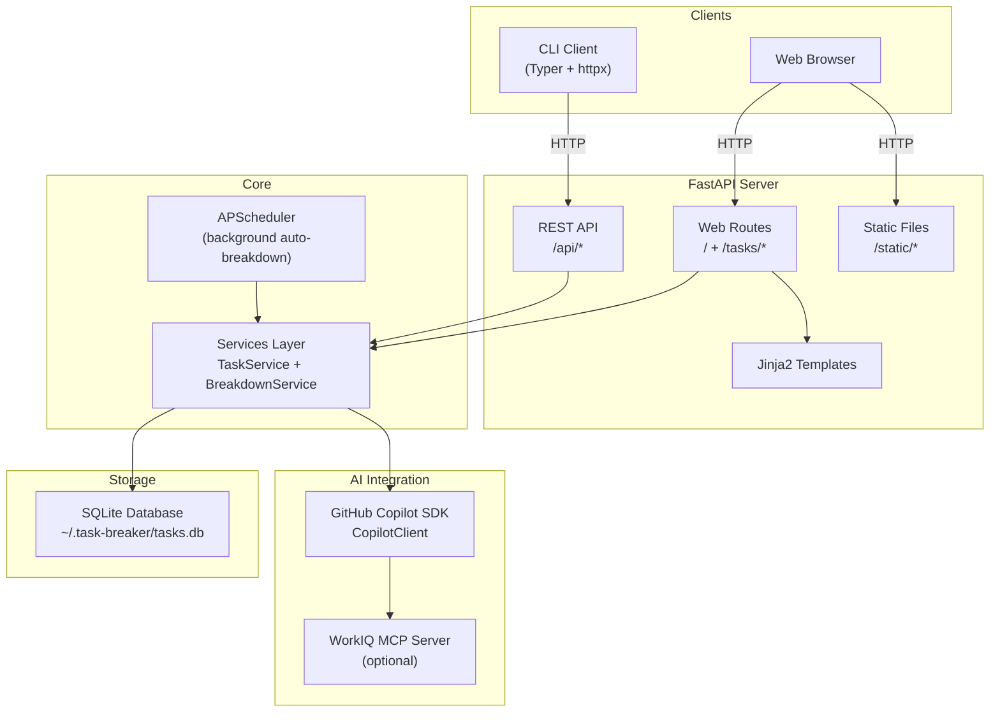
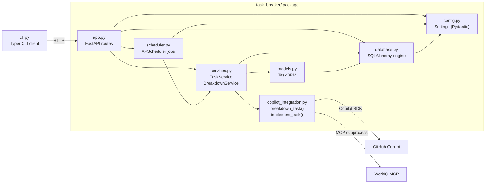
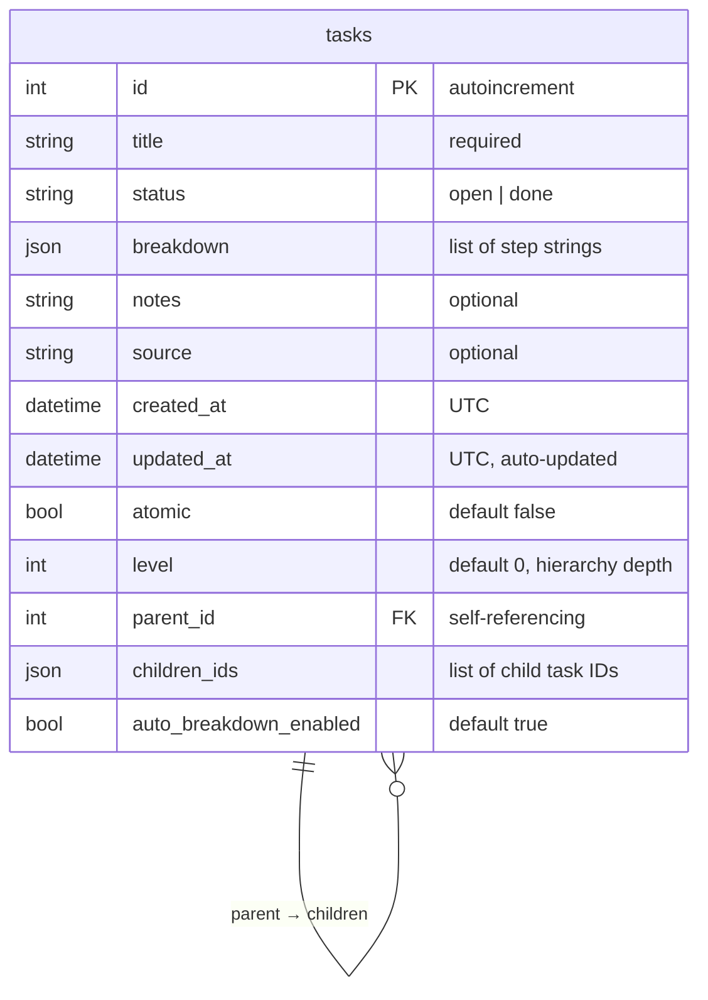
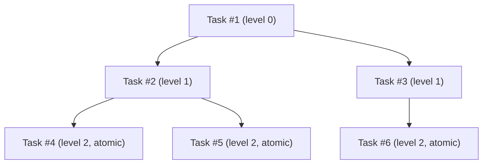
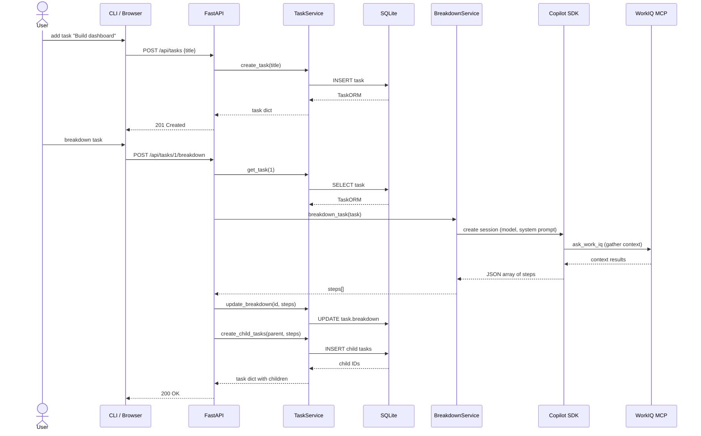
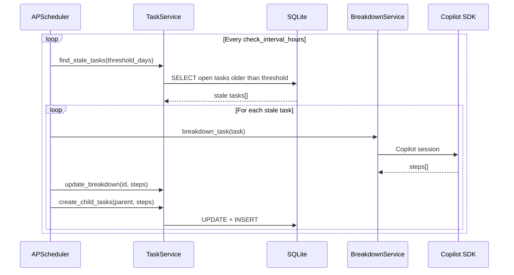
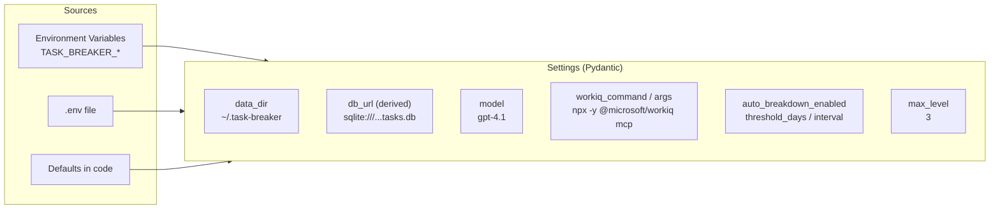
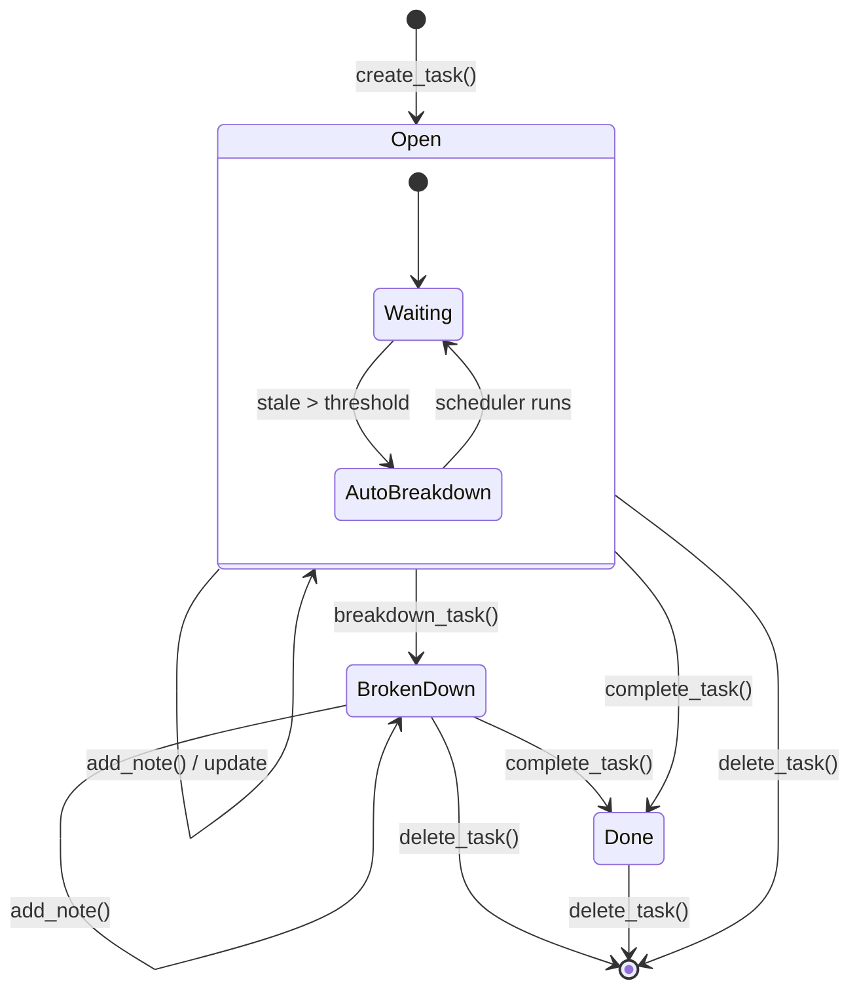

# Task Breaker — Design Document

## Overview

Task Breaker is a local task management application that uses AI (GitHub Copilot SDK + WorkIQ MCP) to automatically break down high-level tasks into smaller, actionable steps. It exposes both a web UI and a REST API, with a CLI client for terminal use.

---

## High-Level Architecture

---

## Component Diagram

---

## Data Model

### Task Hierarchy

Tasks form a tree via `parent_id` / `children_ids`. When `level >= max_level` (default 3), child tasks are marked `atomic = true` and cannot be broken down further.

---

## Request Flow

### API Task Creation + Breakdown

### Auto-Breakdown (Scheduler)

---

## Configuration

| Setting | Default | Description |
|---------|---------|-------------|
| `data_dir` | `~/.task-breaker` | Storage directory |
| `model` | `gpt-4.1` | Copilot model |
| `max_level` | `3` | Max task hierarchy depth |
| `auto_breakdown_enabled` | `true` | Enable scheduler |
| `auto_breakdown_threshold_days` | `3` | Days before auto-breakdown |
| `check_interval_hours` | `1` | Scheduler check interval |

---

## Task Lifecycle

---

## API Endpoints Summary

| Method | Path | Description |
|--------|------|-------------|
| `GET` | `/api/tasks` | List tasks (optional `?status=`) |
| `POST` | `/api/tasks` | Create task |
| `GET` | `/api/tasks/{id}` | Get task details |
| `POST` | `/api/tasks/{id}/complete` | Mark done |
| `POST` | `/api/tasks/{id}/note` | Add/update note |
| `POST` | `/api/tasks/{id}/breakdown` | Trigger AI breakdown |
| `DELETE` | `/api/tasks/{id}` | Delete task (returns deleted task JSON) |
| `GET` | `/api/settings` | Get settings |
| `PUT` | `/api/settings` | Update settings (in-memory) |
