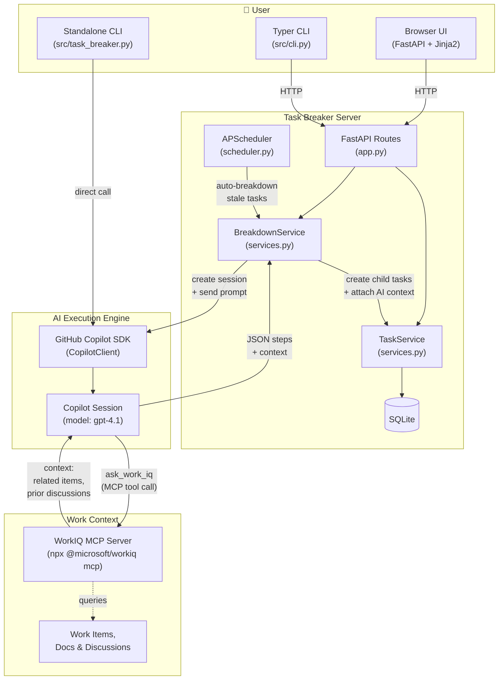

# Task Breaker — Documentation

## Problem Statement

Daily task lists quickly become overwhelming when individual items are too large to act on. Tasks pile up, progress stalls, and the growing backlog becomes discouraging. The root cause is that tasks aren't broken down into small enough chunks to start working on.

## Solution

**Task Breaker** is a local task management application that uses AI to automatically break down high-level tasks into smaller, actionable steps. When a task remains unresolved for a configurable number of days, Task Breaker automatically splits it into manageable sub-tasks — increasing the probability that work moves forward.

It leverages:
- **GitHub Copilot SDK** for AI-powered task decomposition
- **WorkIQ MCP** (optional) for contextual grounding based on the user's work environment

## Architecture

Task Breaker supports two modes:

### Server Mode (Primary)
A FastAPI web server with a browser-based UI, REST API, and Typer CLI client.

```
┌─────────────┐   ┌─────────────┐
│  Web Browser │   │  CLI Client  │
│  (HTML/CSS)  │   │  (Typer)     │
└──────┬───────┘   └──────┬───────┘
       │ HTTP              │ HTTP
       ▼                   ▼
┌──────────────────────────────────┐
│        FastAPI Server            │
│  ┌────────┐  ┌────────────────┐  │
│  │ Web UI │  │   REST API     │  │
│  │ Routes │  │   /api/*       │  │
│  └───┬────┘  └───────┬────────┘  │
│      └───────┬───────┘           │
│         ┌────▼─────┐             │
│         │ Services │             │
│         └──┬────┬──┘             │
│     ┌──────▼┐ ┌─▼──────────┐    │
│     │SQLite │ │ Copilot SDK│    │
│     │  DB   │ │ + WorkIQ   │    │
│     └───────┘ └────────────┘    │
│         ┌──────────┐            │
│         │APScheduler│ (auto)    │
│         └──────────┘            │
└──────────────────────────────────┘
```




### Standalone CLI Mode
A single-file CLI (`task_breaker.py`) that talks directly to the Copilot SDK. Tasks stored in JSON.

> See [design.md](design.md) for detailed Mermaid architecture diagrams, data model, and request flow sequences.

## Prerequisites

- Python 3.10+
- [uv](https://docs.astral.sh/uv/) (Python package manager)
- [GitHub Copilot CLI](https://www.npmjs.com/package/@github/copilot) installed and authenticated
- Node.js (for WorkIQ MCP via npx)

### Windows Note
On Windows, set `COPILOT_CLI_PATH` to the npm-installed `.cmd` wrapper to avoid conflicts with the VS Code bootstrapper:
```powershell
$env:COPILOT_CLI_PATH = "$env:APPDATA\npm\copilot.cmd"
```

## Setup & Running

### Install Dependencies
```bash
uv sync          # creates .venv and installs all dependencies
```

### Server Mode
```bash
# Start the server
uv run python src/cli.py serve

# Open the web portal
# http://127.0.0.1:8000

# Use the CLI client (server must be running)
uv run python src/cli.py add "Plan Q2 roadmap"
uv run python src/cli.py add "Build login page" --breakdown
uv run python src/cli.py list
uv run python src/cli.py show 1
uv run python src/cli.py breakdown 1
uv run python src/cli.py complete 1
```

### Standalone CLI Mode
```bash
uv run python src/task_breaker.py add "Plan Q2 roadmap" --breakdown
uv run python src/task_breaker.py list
uv run python src/task_breaker.py breakdown 1
```

## Deployment

Task Breaker runs **locally** — no cloud deployment required. Data is stored in `~/.task-breaker/`.

| File | Location |
|------|----------|
| SQLite database (server mode) | `~/.task-breaker/tasks.db` |
| JSON storage (standalone mode) | `~/.task-breaker/tasks.json` |
| Usage logs (optional) | `~/.task-breaker/usage.log` |

### Configuration
Set environment variables (prefix `TASK_BREAKER_`) or create a `.env` file:
```
TASK_BREAKER_MODEL=gpt-4.1
TASK_BREAKER_AUTO_BREAKDOWN_ENABLED=true
TASK_BREAKER_AUTO_BREAKDOWN_THRESHOLD_DAYS=3
TASK_BREAKER_CHECK_INTERVAL_HOURS=1
TASK_BREAKER_MAX_LEVEL=3
```

## REST API

| Method | Path | Description |
|--------|------|-------------|
| GET | `/api/tasks` | List tasks (`?status=open\|done`) |
| POST | `/api/tasks` | Create task `{"title": "..."}` |
| GET | `/api/tasks/{id}` | Get task |
| POST | `/api/tasks/{id}/complete` | Mark done |
| POST | `/api/tasks/{id}/note` | Add note `{"note": "..."}` |
| DELETE | `/api/tasks/{id}` | Delete task |
| POST | `/api/tasks/{id}/breakdown` | Trigger AI breakdown |
| GET | `/api/settings` | Get settings |
| PUT | `/api/settings` | Update settings |

## Responsible AI (RAI) Notes

### What the AI Does
- Task Breaker uses GitHub Copilot to decompose user-provided task descriptions into smaller sub-tasks
- Optionally uses WorkIQ MCP to gather workplace context (calendar, emails, etc.) for more relevant breakdowns

### Data & Privacy
- **All data stays local** — tasks are stored in SQLite/JSON on the user's machine
- No task data is sent to external services beyond the Copilot API call
- WorkIQ context is gathered locally via MCP and processed in-session
- No telemetry or analytics are collected

### Limitations
- AI-generated breakdowns may not always be actionable or correctly scoped
- The quality of breakdowns depends on the clarity of the original task description
- WorkIQ context quality depends on the user's connected services
- Auto-breakdown runs on a timer and may break down tasks the user intended to keep as-is (can be disabled per-task or globally)

### Human Oversight
- Users can review, edit, and delete AI-generated sub-tasks
- Auto-breakdown can be disabled globally or per-task via `auto_breakdown_enabled`
- The `atomic` flag prevents further breakdown of tasks the user deems small enough
