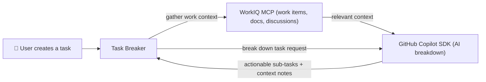
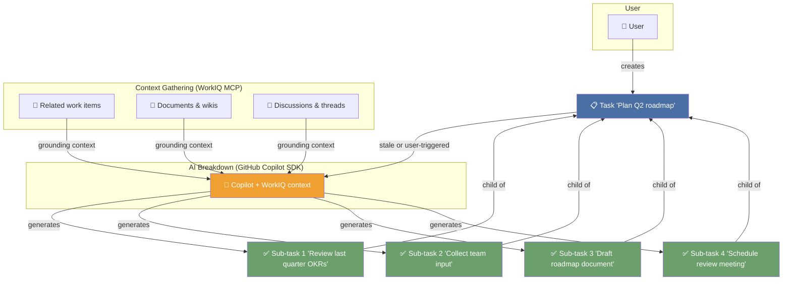

## Task Breaker

AI-powered task decomposition for productivity. Automatically breaks down stale tasks into smaller, actionable steps using GitHub Copilot SDK and WorkIQ MCP.

### Quick Start

```bash
uv sync                                  # install dependencies
uv run python src/cli.py serve           # start the server
# open http://127.0.0.1:8000             # web portal
uv run python src/cli.py add "My task" --breakdown   # add + break down
```

> **Note:** You must accept the [WorkIQ MCP EULA](https://github.com/microsoft/work-iq-mcp) before using context-gathering features. The server will prompt you on first use, or you can accept it via the settings page. This feature might not work in some scenario. In that case, use @modelcontextprotocol/inspector or other tools to accept it.  
`npx @modelcontextprotocol/inspector npx -y @microsoft/workiq mcp`

### Project Structure

```
src/                    # Working source code
  cli.py                #   Typer CLI client (server mode)
  task_breaker.py       #   Standalone CLI (no server required)
  task_breaker/         #   FastAPI server package
docs/                   # Full documentation
  README.md             #   Problem, setup, deployment, architecture, RAI notes
  design.md             #   Architecture diagrams (Mermaid)
presentations/          # Demo deck
  TaskBreaker.md        #   Draft script (placeholder for .pptx)
AGENTS.md               # Custom instructions for AI agents
mcp.json                # MCP server configuration (WorkIQ)
```

### Architecture Overview



1. User adds a high-level task.
2. Task Breaker queries **WorkIQ** for related work items, docs, and discussions.
3. That context feeds into the **GitHub Copilot SDK**, which generates an actionable breakdown.
4. Sub-tasks (with AI context) are saved back and ready to work on.

### Task Breakdown Flow



**Key:** A single user task becomes multiple actionable sub-tasks, each informed by real workplace context — so breakdowns are relevant, not generic.


### Feature Status

**Implemented:**
- Task breakdown — AI-powered decomposition of high-level tasks into actionable sub-steps
- Context gathering — WorkIQ MCP integration to fetch related work items, docs, and discussions and attach them to tasks
- Naive Task implementation — using GitHub Copilot SDK to try executing a task directly

**Not yet implemented:**
- Automatic task execution — end-to-end autonomous execution of tasks
- Task type detection — classifying tasks by action type (writing a PoC, drafting an email, etc.) to route them appropriately
- SKILL.md-based multi-task execution — leveraging skill definitions to orchestrate execution across multiple tasks

### Documentation

See **[docs/README.md](docs/README.md)** for full documentation including:
- Problem → Solution narrative
- Prerequisites and setup
- Deployment guide
- Architecture diagrams
- REST API reference
- Responsible AI notes
